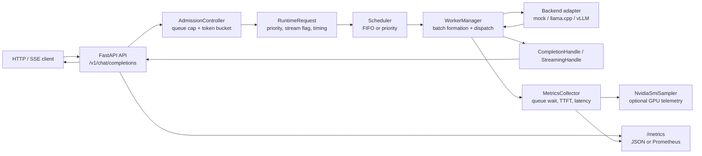

# GPU-Aware LLM Serving Runtime
[](https://github.com/KiriSchrieffer/llm-serving-runtime/actions/workflows/tests.yml)

A small local LLM serving runtime focused on the systems work behind inference serving: async request handling, scheduling, batching, streaming, metrics, and reproducible benchmarking.

This project is intentionally not an agent framework. It does not implement tools, RAG, fine-tuning, or CUDA kernels. The default path uses a mock backend that simulates prefill and decode latency so the serving path can be tested without a GPU.

## Why This Exists

LLM serving is a systems problem: requests arrive concurrently, wait in queues, get scheduled into batches, stream tokens back to clients, and produce latency and throughput metrics. This repository demonstrates that engineering surface in a compact, inspectable Python service.

The goal is to make tradeoffs visible:

- FIFO vs priority scheduling
- single-request serving vs dynamic batching
- time-to-first-token vs total latency
- queue wait time under load
- backend adapter boundaries for llama.cpp and vLLM

## Architecture



The runtime has these layers:

- **API layer**: FastAPI routes for health, metrics, and OpenAI-style chat completions.
- **Admission control**: optional queue-cap and token-bucket guards that reject
  overload before requests enter the scheduler.
- **Core request model**: internal request object with ID, messages, priority, timing, stream flag, and sampling params.
- **Scheduler**: FIFO and priority-based schedulers, both with dynamic batch formation using configurable size and timeout.
- **Backend**: abstract backend interface with mock, llama.cpp, and vLLM adapters. The real backends manage external `llama-server` / `vllm serve` subprocesses.
- **Worker path**: background batch execution with per-request result routing through completion or streaming channels.
- **Streaming**: Server-Sent Events for streaming chat completions.
- **Metrics**: in-memory counters, latency histograms, optional GPU telemetry,
  Prometheus text-format export, and structured JSON request logs.

## Current Status

What is implemented and tested:

- `GET /health`
- `GET /metrics` (JSON and Prometheus text format)
- `POST /v1/chat/completions` (OpenAI-compatible)
- non-streaming responses
- streaming responses (Server-Sent Events)
- FIFO scheduler
- Priority scheduler with optional aging fairness policy
- mock token generation
- llama.cpp backend adapter with `llama-server` subprocess lifecycle
- vLLM backend adapter with `vllm serve` subprocess lifecycle
- background async worker execution with per-request response channels
- dynamic micro-batching with configurable maximum size and collection timeout
- non-streaming request timeout handling and streaming disconnect cancellation
- optional admission control with maximum queue size and token-bucket request
  rate limiting
- batch-aware mock backend with shared prefill/decode simulation
- batch size, queue wait, TTFT, total latency, and token metrics
- optional `nvidia-smi` GPU memory/utilization sampler with unavailable fallback
- priority scheduler benchmark with high-priority TTFT, low-priority queue wait,
  starvation, fairness, and aging-policy metrics
- rejected-request metrics by reason and priority
- JSON metrics snapshots and Prometheus-style text exposition
- structured JSON request lifecycle logging
- CI quality gates with `ruff`, `mypy`, and `pytest`
- pytest coverage for core paths (65 test cases)

Known limitations:

- mock-backend benchmarks validate serving behavior, not real GPU throughput
- llama.cpp benchmark artifacts are CPU-only and hardware-specific
- vLLM support is an adapter boundary; it requires a local vLLM installation and model access
- GPU metrics use `nvidia-smi`; unsupported hosts report `unavailable`
- Redis-backed queues
- production authentication, distributed rate limiting, and multi-node serving

## Benchmark Coverage

Benchmark scripts and saved artifacts track:

- tokens/s
- P50 latency
- P95 latency
- TTFT
- queue wait time
- batch size distribution
- priority scheduling fairness/starvation tradeoffs

Mock-backend runs are complete and documented. The repository also includes CPU-only llama.cpp notes to show how mock results differ from a real backend.
The curated benchmark write-up lives in `docs/benchmark_report.md`; raw JSON
artifacts live under `benchmarks/results/`.

## Run Locally

```bash
python -m venv .venv
source .venv/bin/activate
pip install -r requirements-dev.txt
uvicorn llm_runtime.main:app --reload
```

On Windows PowerShell, activate with `.venv\Scripts\Activate.ps1`.
For dependency upgrades, edit `pyproject.toml` first and then refresh
`requirements-dev.txt` from a tested virtual environment.

Health check:

```bash
curl http://127.0.0.1:8000/health
```

Runtime metrics:

```bash
curl http://127.0.0.1:8000/metrics
```

Abbreviated JSON output after a small mock request:

```json
{
  "request_count": 1,
  "completed_count": 1,
  "failed_count": 0,
  "rejected_count": 0,
  "rejections_by_reason": {},
  "rejections_by_priority": {},
  "active_requests": 0,
  "generated_tokens_total": 4,
  "batch_count": 1,
  "batch_size_avg": 1.0,
  "batch_size_distribution": {"1": 1},
  "queue_wait_time_avg_s": 0.0001,
  "ttft_avg_s": 0.045,
  "total_latency_avg_s": 0.095,
  "gpu": {
    "status": "unavailable",
    "source": "nvidia-smi",
    "reason": "nvidia-smi not found",
    "gpu_count": 0,
    "memory_used_mb": 0,
    "memory_total_mb": 0,
    "utilization_pct": 0,
    "gpus": []
  },
  "queue_size": 0
}
```

Non-streaming chat completion:

```bash
curl -X POST http://127.0.0.1:8000/v1/chat/completions \
  -H "Content-Type: application/json" \
  -d "{\"model\":\"mock-llm\",\"messages\":[{\"role\":\"user\",\"content\":\"hello\"}],\"max_tokens\":8}"
```

Streaming chat completion:

```bash
curl -N -X POST http://127.0.0.1:8000/v1/chat/completions \
  -H "Content-Type: application/json" \
  -d "{\"model\":\"mock-llm\",\"messages\":[{\"role\":\"user\",\"content\":\"stream a short reply\"}],\"max_tokens\":4,\"stream\":true}"
```

Example SSE output:

```text
data: {"id": "chatcmpl-...", "object": "chat.completion.chunk", "model": "mock-llm", "choices": [{"index": 0, "delta": {"content": "tok0 "}, "finish_reason": null}]}

data: {"id": "chatcmpl-...", "object": "chat.completion.chunk", "model": "mock-llm", "choices": [{"index": 0, "delta": {"content": "tok1 "}, "finish_reason": null}]}

data: {"id": "chatcmpl-...", "object": "chat.completion.chunk", "model": "mock-llm", "choices": [{"index": 0, "delta": {"content": "tok2 "}, "finish_reason": null}]}

data: {"id": "chatcmpl-...", "object": "chat.completion.chunk", "model": "mock-llm", "choices": [{"index": 0, "delta": {"content": "tok3 "}, "finish_reason": null}]}

data: [DONE]
```

Admission control example:

```bash
LLM_RUNTIME_MAX_QUEUE_SIZE=128 \
LLM_RUNTIME_REQUEST_RATE_LIMIT_PER_S=50 \
LLM_RUNTIME_REQUEST_RATE_LIMIT_BURST=100 \
uvicorn llm_runtime.main:app
```

When enabled, queue overload is rejected before enqueue with `503`, and
token-bucket rate limiting is rejected with `429`. Rejections are exported in
JSON metrics and Prometheus text format.

Run tests:

```bash
python -m pytest
```

Run local quality checks:

```bash
python -m ruff check src tests benchmarks
python -m mypy
python -m pytest -q
```

## Run with Docker

```bash
docker compose up --build llm-runtime
```

Run a quick benchmark against the compose service:

```bash
docker compose --profile benchmark up --build benchmark
```

## Compare Batching Modes

Run the reproducible mock-backend comparison suite:

```powershell
$env:PYTHONPATH="src"; python benchmarks/run_local_comparison.py --mode both --levels 1 8 16 32 64 --requests 64 --max-tokens 32 --max-batch-size 8 --batch-timeout-ms 10 --prefill-latency-ms 25 --decode-latency-ms 10 --output-dir benchmarks/results
python benchmarks/analyze_results.py --baseline benchmarks/results/fifo_baseline.json --dynamic benchmarks/results/dynamic_batching.json
```

The runner creates a fresh local Uvicorn app for each mode, ensuring in-memory
metrics do not leak between the FIFO and dynamic batching experiments. The
first recorded mock result is documented in `docs/benchmark_report.md`.

Run a fixed high-concurrency parameter sweep:

```powershell
$env:PYTHONPATH="src"; python benchmarks/run_batch_sweep.py --concurrency 64 --requests 64 --max-tokens 32 --batch-sizes 2 4 8 16 --timeouts 0 5 10 20 --prefill-latency-ms 25 --decode-latency-ms 10 --output benchmarks/results/batch_sweep_c64.json
python benchmarks/analyze_batch_sweep.py --sweep benchmarks/results/batch_sweep_c64.json --baseline benchmarks/results/fifo_baseline.json --ttft-budget-ms 1000
```

Run the mixed-priority scheduler benchmark:

```bash
python benchmarks/run_priority_scheduler_benchmark.py --output benchmarks/results/priority_scheduler_mixed.json
```

The default workload creates a low-priority backlog, injects high-priority
requests after 40 ms, and compares FIFO, strict priority, and priority aging.
The saved artifact reports high-priority TTFT, low-priority queue wait, Jain
fairness over inverse queue wait, and low-priority starvation counts.

Generate a scratch Markdown view from raw benchmark JSON artifacts:

```bash
python benchmarks/generate_report.py --output benchmarks/results/generated_benchmark_report.md
```

This generated Markdown is intentionally ignored by git. Keep curated benchmark
analysis in `docs/benchmark_report.md`.

To manually run a server with dynamic batching enabled:

```powershell
$env:LLM_RUNTIME_ENABLE_BATCHING="true"
$env:LLM_RUNTIME_MAX_BATCH_SIZE="8"
$env:LLM_RUNTIME_BATCH_TIMEOUT_MS="10"
uvicorn llm_runtime.main:app
```

To run with the llama.cpp backend:

```powershell
$env:LLM_RUNTIME_BACKEND="llama.cpp"
$env:LLM_RUNTIME_MODEL_PATH="path/to/model.gguf"
$env:LLM_RUNTIME_N_GPU_LAYERS="35"
uvicorn llm_runtime.main:app
```
